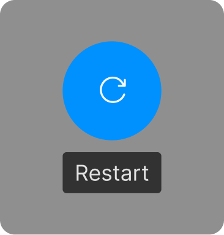

## Restart a project/flow

<Columns cols={2}>
<Frame>

 Long pinch middle finger.
</Frame>

<Frame>

 Hold and wait until the blue circle is fully blue.
</Frame>
</Columns>

---

## Exit a flow (back to home)

<Columns cols={2}>
<Frame>

 Long pinch ring finger
</Frame>

<Frame>

 Hold and wait until the blue circle is fully blue.
</Frame>
</Columns>

