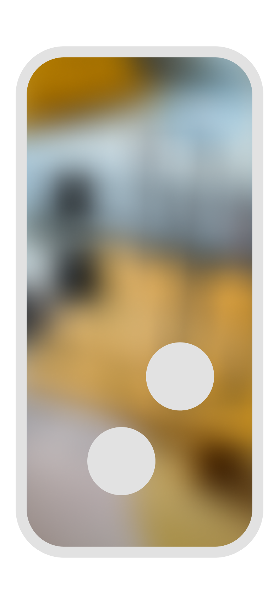
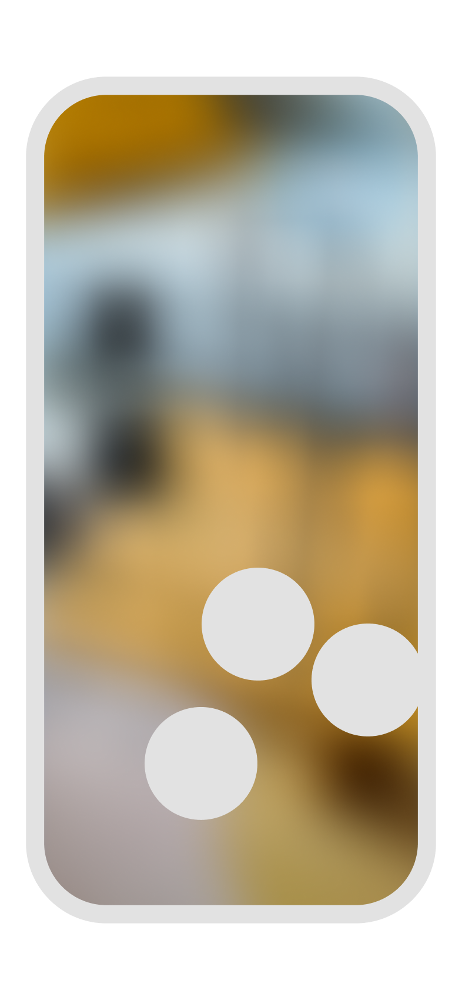

## Restart a project/flow

<Columns cols={2}>
<Frame>

Long tap (3sec) with two fingers anywhere on the screen.   Restarting a flow will fetch the latest version of the flow.

</Frame>
</Columns>

---

## Exit a flow (back to home)

<Columns cols={2}>
<Frame>

Long tap with three fingers anywhere on the screen.

</Frame>
</Columns>
