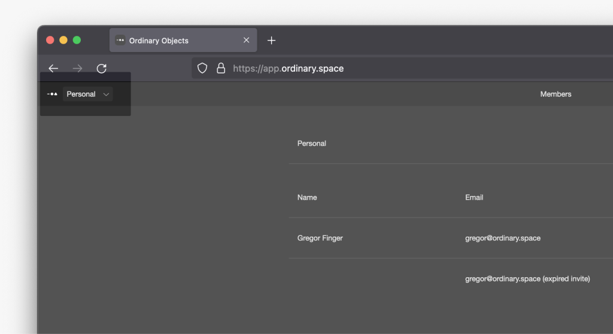
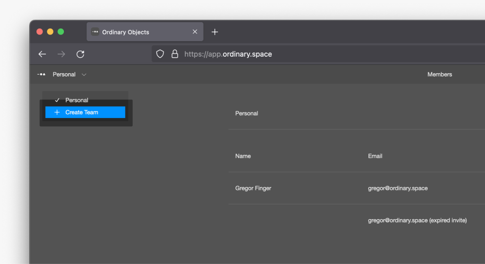
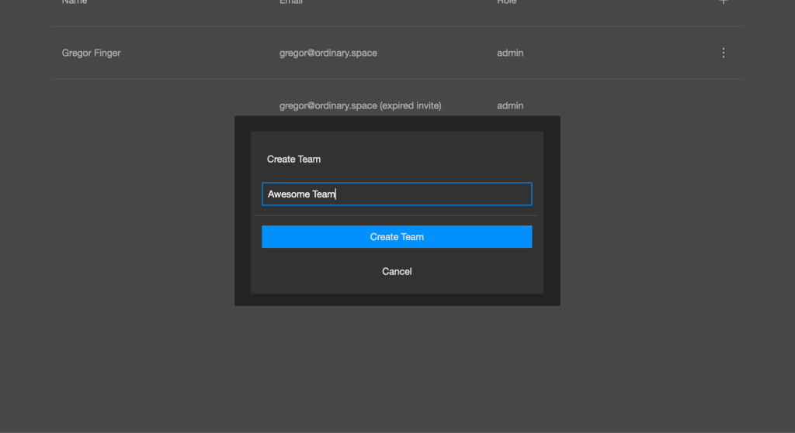
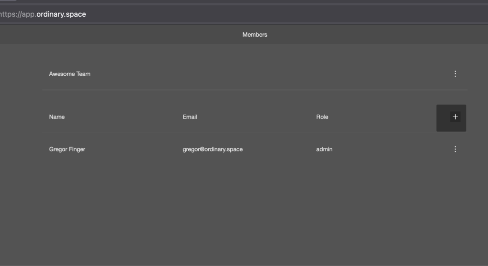
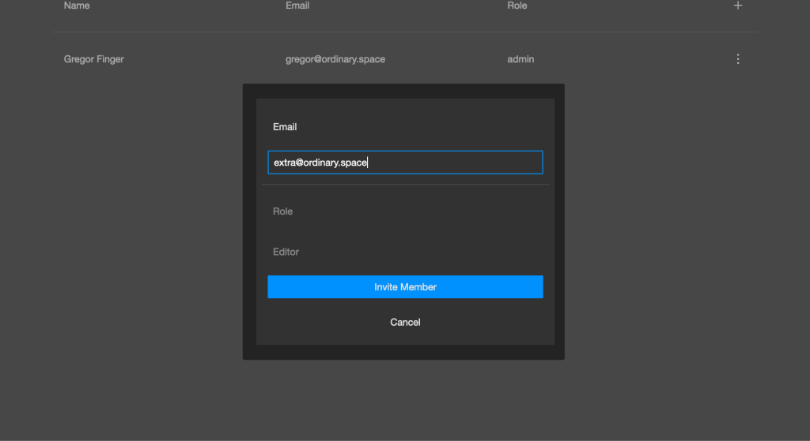
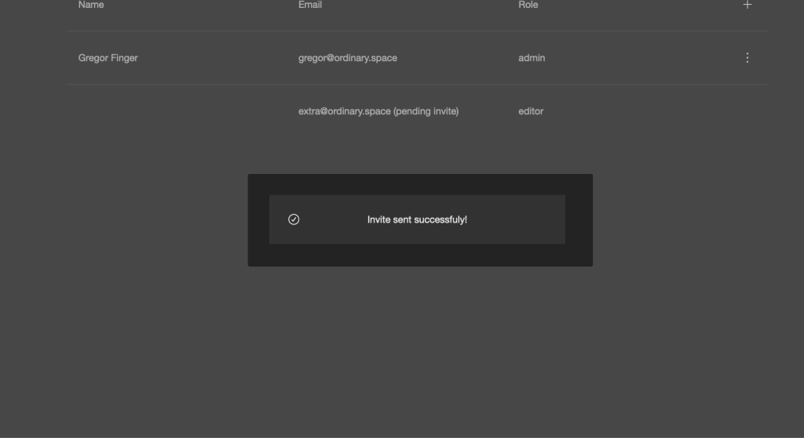
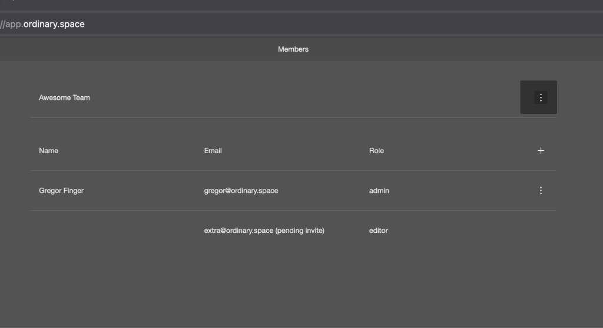
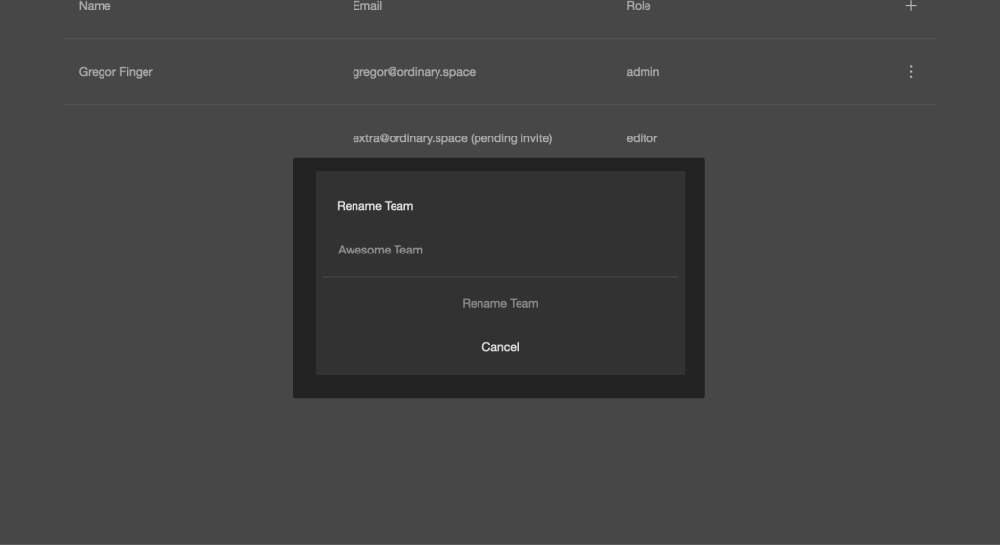

<Note>
Account and team management must be done via the Portal [app.ordinary.space](http://app.ordinary.space)
</Note>
## Create a team

<Steps>
  <Step title="Login to the portal">
    Go to [app.ordinary.space](http://app.ordinary.space) and login with your admin account
  </Step>
  <Step title="Open the team selection">
    In the top bar in the middle, click on `Personal` to expand the team dropdown.
    
  </Step>
  <Step title="Create a new team">
    In the dropdown, click on `Create Team`
    
  </Step>

  <Step title="Set the name and confirm">
    Set the team name in the pop-up and press `Create Team`
    
    
  </Step>
</Steps>

--- 

## Invite Collaborators to your team
<Note>
You might need to refresh the browser, and restart editor and mirror to see the new teams.
</Note>
<Steps>
  <Step title="Select the team">
    Select the team, you want to invite your collaborators to, from the team dropdown
  </Step>

  <Step title="Add collaborator">
    Click on the plus `+` icon to the right in the members list header.
    
    
  </Step>

  <Step title="Invite via email">
    Type in the user's email address
    
    
  </Step>

  <Step title="Send the invitation">
    Press `Invite Member`
    
    
  </Step>
</Steps>

---
## Change the team name

<Steps>
    <Step title="Select the team">
        Select the team, you want to change the name of, from the team dropdown
    </Step>
  <Step title="Open the context menu">
    Click on the three dots menu to the left of the team name.
    
    
  </Step>
<Step title="Fill out the new name">
    Type in the new name in the pop-up and press `Rename Team`
    
    
  </Step>
</Steps>

---
## Limitations

- For now, it’s only possible to invite other users as Editor, not Admin to a team.
- For now, it’s not possible to delete teams.