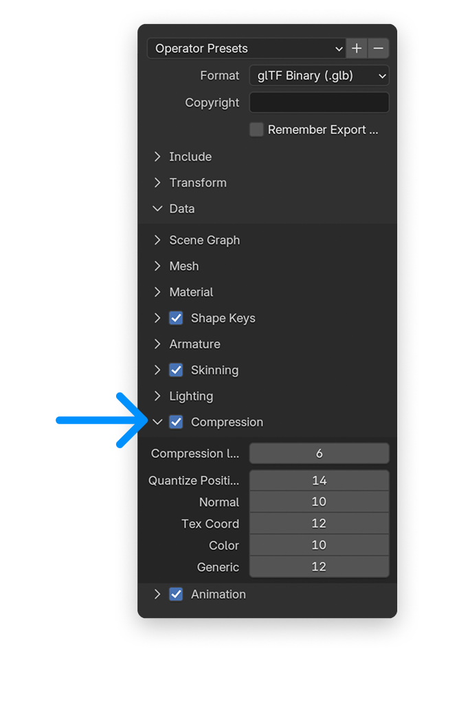

## Export Compression
<Columns cols={2}>
<Frame style={{ border: '0px', background:'white'}}>
A quick win to make heavy 3D assets more performant and save on file size is to compress it's textures.
Blender offers a simple checkbox on export with various parameters to optimise even further.
</Frame>

<Frame style={{ border: '0px', background:'white'}}>

</Frame>
</Columns>

## Optimize texture maps
The Blender plugin [SimpleBake](https://superhivemarket.com/products/simplebake---simple-pbr-and-other-baking-in-blender-2) helps to optimize textures for exmaple by allowing you to separately bake the textures of a selected object.

## View 3D models in your file system
When creating multiple versions of a 3D model, it can be tricky to compare or find the right one. [3DViewer.xyz](https://3dviewer.xyz/) is a great helper that integrates nicely with your macOS finder to preview 3D models of varrying file fromats.