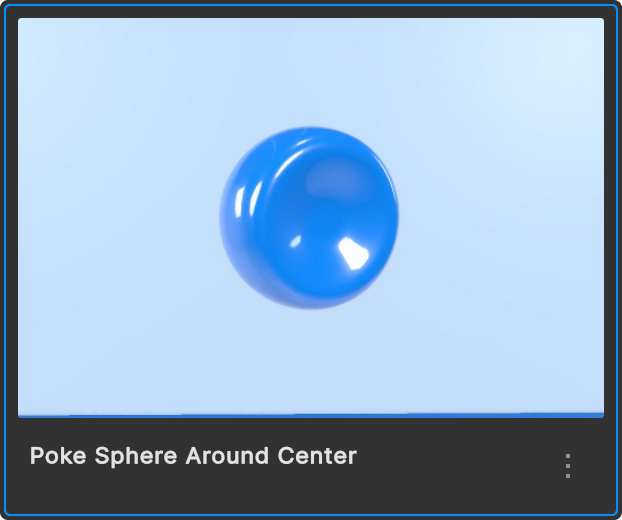

You can find the templates in the sidebar on the left side of the Editor.

<Note>
To get going you need:
- An Ordinary Objects account
- The editor on Mac or Windows
- The mirror on Vision Pro / iOS / iPadOS / Meta Quest
</Note>

## Poke Sphere Around Center

A simple yet playful exploration of a speculative user interface. 

On Vision Pro, simply point at and come closer to the sphere with your right index finger.
Rotate it around its center and leave it in that position by moving your finger away again.

**Bonus: try to modify the template in the editor**:
- Change the color of the sphere when active and inactive.
- Adjust the interaction to the left index finger.

---
## Options Carousel (Vision Pro)

<Note>
For Vision Pro use the template with the extension (Vision Pro). 
</Note>

A demo that lets you cycle through different options of a speculative product selection. 

Gaze+pinch the arrows to show the next or previous option.

**Bonus: try to modify the template in the editor**: 

- Instead of hiding the inactive options, just have them move to the background.
- Add a fourth option.

---
## Wearable Demo

A playful exploration of reviewing fitness data. 

Look at your left hand outside wrist. Either gaze+pinch the button or wait a split second to preview the data on the wrist.

Rotate the map by moving your right index finger closer and around.

Enlarge and lock the map in space by clicking the open button.

**Bonus: try to modify the template in the editor**: 

- Instead of playing the runner marker animation immediately, add a button to trigger the animation.

 

Suggest more templates in Discord.